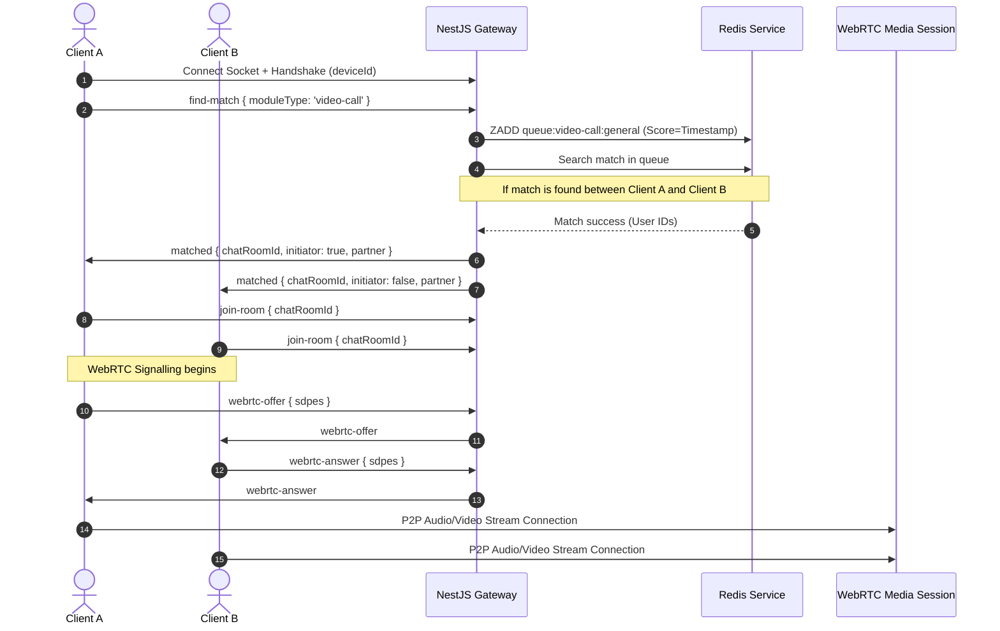

# PulseRoom - Technical Architecture & Developer Reference

This document details the underlying protocol flows, WebSocket subscriptions, Redis indexes, and WebRTC handshakes powering the PulseRoom matchmaking ecosystem.

---

## 🏗️ System Architecture & Data Flow

PulseRoom uses a decoupled Next.js frontend client and a stateless NestJS backend API clustered using Redis.



---

## 🔌 WebSocket Socket.IO Event Reference

All real-time communications flow through the NestJS `ChatGateway` (mounted at namespace `/`).

### Client Subscriptions (Emitted by Client, Handled by Server)

| Event Name | Payload Schema | Description |
| :--- | :--- | :--- |
| `find-match` | `{ deviceId: string, moduleType: 'chat'\|'voice-call'\|'video-call' }` | Initiates matchmaking queue search. |
| `cancel-search` | `(empty)` | Cancels matchmaking search and removes socket from the Redis queue. |
| `join-room` | `{ chatRoomId: string }` | Joins the Socket.IO channel room for a matched session. |
| `send-message` | `{ chatRoomId: string, content: string }` | Broadcasts a text message to all users joined in `chatRoomId`. |
| `leave-room` | `{ chatRoomId: string }` | Gracefully leaves the active session room and resets queue parameters. |
| `request-new-icebreaker` | `{ chatRoomId: string }` | Triggers the server to pick a random icebreaker prompt and broadcast it to the room. |
| `typing` | `{ chatRoomId: string }` | Emits a typing notification indicator. |
| `stop-typing` | `{ chatRoomId: string }` | Clears the typing indicator. |
| `webrtc-offer` | `{ chatRoomId: string, offer: RTCSessionDescriptionInit }` | Sends a WebRTC connection offer to the matching peer in the room. |
| `webrtc-answer` | `{ chatRoomId: string, answer: RTCSessionDescriptionInit }` | Sends a WebRTC connection answer to the matching peer. |
| `webrtc-ice-candidate`| `{ chatRoomId: string, candidate: RTCIceCandidate }` | Exchange local network candidates during P2P negotiation. |
| `send-friend-request` | `{ targetUserId: string }` | Emits a socket request notification to target socket ID. |
| `accept-friend-request`| `{ targetUserId: string }` | Approves requests and appends credentials to MongoDB profile structures. |
| `reward-completed-call`| `{ callDuration: number }` | Rewards users with coins and streaks if call duration exceeds 60s. |

### Server Broadcasts (Emitted by Server, Handled by Client)

| Event Name | Payload Schema | Description |
| :--- | :--- | :--- |
| `waiting` | `{ success: boolean }` | Notifies client that matchmaking is searching in queues. |
| `matched` | `{ chatRoomId: string, initiator: boolean, icebreaker: string, partner: User }` | Notifies matched clients of session parameters. |
| `receive-message` | `{ content: string, sender: string }` | Broadcasts incoming messages inside room channels. |
| `new-icebreaker` | `{ icebreaker: string }` | Syncs a shuffled conversation starter card in the matched room. |
| `live-users-count` | `{ totalOnline: number, searchingCount: number }` | Periodically broadcasts total connected users and actively searching queues metrics. |
| `captcha-required` | `{ success: boolean }` | Notifies client that rate limits were hit and they must resolve a CAPTCHA. |

---

## 🗄️ Redis Key Structure

PulseRoom uses Redis to coordinate matchmaking latency and count active live socket connections.

- **`queue:<moduleType>:general`** [Sorted Set]: Matchmaking waiting queue for general users. Score is the connection timestamp (`Date.now()`), and value is stringified client metadata JSON (`userId`, `socketId`, `tags`, etc.).
- **`queue:<moduleType>:shadowban`** [Sorted Set]: Isolated queue where shadowbanned users (`isShadowbanned = true`) can only match with other shadowbanned users.
- **`online:users`** [Hash]: Maps unique `userId` / `deviceId` to the count of their active socket connections. Used to track exact unique online user counts.
- **`socket:user`** [Hash]: Maps active `socketId` to the matching unique `userId` for quick resolution during disconnect.
- **`ratelimit:<userId>`** [List]: Sliding window timestamps list used to throttle rapid skip / match requests. Maximum 5 requests within 10 seconds.

---

## 🌐 WebRTC Peer Connection Sequence

PulseRoom bypasses SFU servers by negotiating client-to-client WebRTC P2P media channels using the Socket.IO gateway as a signaling plane.

```
Client A (Initiator: true)                          Client B (Initiator: false)
         |                                                   |
         |------------- 1. Create Offer (SDP) ---------------|
         |============== 2. Set Local SDP ===================|
         |--- 3. Emit 'webrtc-offer' ---> Socket.IO Gateway -|
         |                                |                  |
         |                                |--> 4. Forward -->|
         |                                                   |==== 5. Set Remote SDP ====|
         |                                                   |--- 6. Create Answer (SDP) |
         |                                                   |==== 7. Set Local SDP =====|
         |                                                   |-- 8. Emit 'webrtc-answer'-|
         |                                |                  |
         |<---------- 9. Forward ---------|                  |
         |==== 10. Set Remote SDP ====|                      |
         |                                                   |
         |--- 11. Exchange ICE Candidate (webrtc-ice-candidate) -|
         |================== 12. P2P Connected ==============|
```
1. **ICE Candidates**: Both clients retrieve public/private routing pathways via `GET /api/webrtc/ice-servers` STUN/TURN configurations.
2. **Autoplay Policies Bypass**: Incoming streams trigger silent visualizer canvas mappings and auto-playing refs. When a user clicks or touches the screen, autoplay browser restrictions are bypassed, and voice is unmuted instantly.
